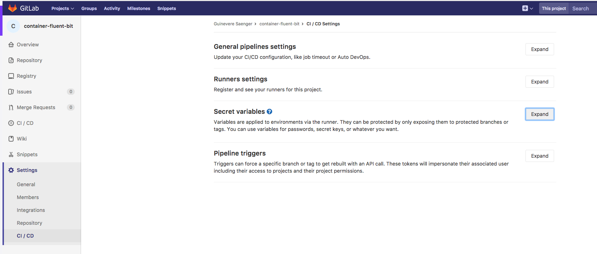
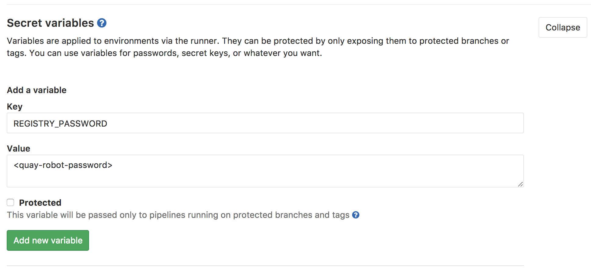
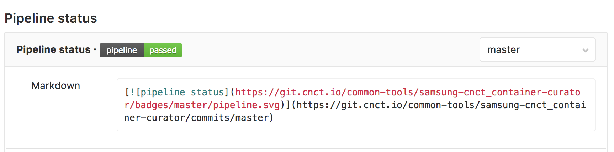

# Overview

This document details the steps to implement our CI/CD pipeline with GitLab. Each GitHub repo is linked to one GitLab project that builds, tests and then deploys an artifact to Quay, such as a container or a chart.

The following steps assume you have already duplicated a repo according to the
[README](../README.md) instructions and in conformance with [GitHub](./github.md)
and [Quay](./quay.md) guidelines. If you are migrating an existing repo, you will need the appropriate [chart](https://github.com/samsung-cnct/solas-chart/blob/master/.gitlab-ci.yml) or [container](https://github.com/samsung-cnct/solas-container/blob/master/.gitlab-ci.yml) `.gitlab-ci.yml` template.

## Edit .gitlab-ci.yml file

* Edit the `CHART_NAME` or `IMAGE_NAME` as well as the `ROBOT_ACCOUNT` in the `variables` section of the gitlab-ci.yml file.

  * For container repositories:

    `IMAGE_NAME: "zabra-container"`

    `ROBOT_ACCOUNT: "zabra_container_rw"` (the name of the robot created during the [Quay](./quay.md#create-a-robot-account) configuration)

    The resulting container image will be deployed to the `quay.io` container
    repository at https://quay.io/application/samsung_cnct/zabra-container?namespace=samsung_cnct .

  * For chart repositories:

    `CHART_NAME: "zabra"` or `CHART_NAME: "zabra-chart"` depending on name availability

    `ROBOT_ACCOUNT: "zabra_rw"` (the name of the robot created during the [Quay](./quay.md#create-a-robot-account) configuration)

    The resulting Helm chart will be deployed to the `quay.io` app
    repository at https://quay.io/application/samsung_cnct/zabra?namespace=samsung_cnct.

## Chart Repositories Only:

* If this is a migration from a previous solas-derived repo:
  - create a `build` folder at the project root
  - create `build/test.sh` and `build/build.sh`
  - copy in the contents of the [test.sh](https://github.com/samsung-cnct/solas-chart/blob/master/build/test.sh) and [build.sh](https://github.com/samsung-cnct/solas-chart/blob/master/build/build.sh) templates
  - run `chmod 755 build/test.sh build/build.sh`
  - move `Chart.yaml.in` inside the `build` folder.      

* Edit `build/Chart.yaml.in`

  * Edit the `name`, `description`, `home` and `sources`. Do not edit the `version`. Add any relevant keywords and look at othe related charts inspiration. For example, if you're creating a logging chart, you might look at the [Fluent Bit Chart](https://github.com/samsung-cnct/chart-fluent-bit).
    ```
    name: zabra
    version: ${CHART_VER}-${CHART_REL}
    description: Sample chart template for registry
    keywords:
    - kraken
    home: https://github.com/samsung-cnct/chart-zabra
    sources:
    - https://github.com/samsung-cnct/chart-zabra
    ```
## Configure GitLab

Get set up with GitLab:
[Samsung GitLab workflow best practices](https://github.com/samsung-cnct/ci-evaluation/blob/master/docs/onboarding.md)

### GitLab environment variables
GitLab comes with a list of handy built-in environment variables, some of which are used in the CI file.
[Reference here](http://docs.gitlab.com/ce/ci/variables/README.html#predefined-variables-environment-variables)

### Define GitLab Secret Variable

  * Your initial PR will create a repo for your project on Gitlab. Once that has been created,  go to `Settings` --> `CI/CD` and expand `Secret Variables`.

    

  * Create a [Secret Variable](https://git.cnct.io/help/ci/variables/README#secret-variables) named `REGISTRY_PASSWORD` and assign it the robot token of the robot created during the [Quay](./quay.md#create-a-robot-account) configuration.

    

### Optional Cleanup stage

Some repositories build very large images, and we may want to clean up any unused branch builds on the GitLab docker image repository. This is currently an upstream work in progress; in the meantime if necessary you can implement it yourself.

First, for a sample cleanup stage, please see the cleanup stage of [container-fluent-bit](https://github.com/samsung-cnct/container-fluent-bit/blob/master/.gitlab-ci.yml). You should be able to copy this verbatim, and then provide some GitLab configurations to make it work:

1. Go to User -> Settings and request a [personal access token](https://docs.gitlab.com/ce/user/profile/personal_access_tokens.html), with API access (read and write)
2. In your Gitlab project repository, follow the steps for [GitLab secrets](#define-gitlab-secrets) to create the following additional secrets:

`DOCKER_USERNAME` - the value should be the name of your personal access token
`DOCKER_PASSWORD` - the value should be the value of your personal access token

These two env variables will be passed into the `docker-registry-curl` tool's `entrypoint` script and allow to remove entries from the registry.

## Add a pipeline status badge to your project's README.md

In Gitlab, head to Settings -> CI/CD, and expand General Pipeline Settings. Scroll down until you see a section called Pipeline Status, then grab the markdown code and put it at the top of your repo's README.md. This will allow the pipeline status to be visible from your project's main page.


