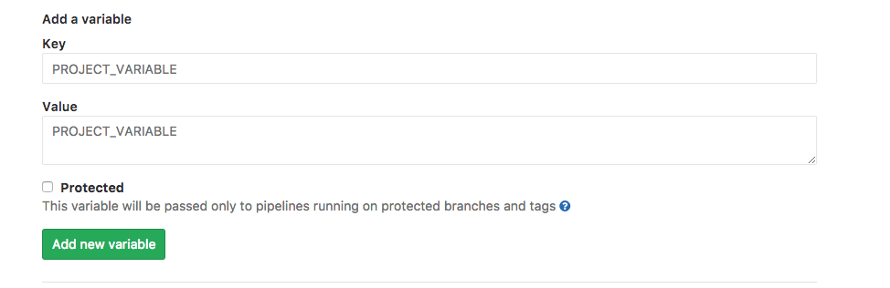

# Overview

This document details the steps to implement our CI/CD pipeline with GitLab. Each GitHub repo is linked to one GitLab project that builds, tests and then deploys an artifact to Quay, such as a container or a chart.

The following steps assume you have already duplicated a repo according to the
[README](../README.md) instructions and in conformance with [GitHub](./github.md)
and [Quay](./quay.md) guidelines.

## Edit gitlab-ci.yml file

* Edit the `chart_name` or `image_name` in the `variables` section of the gitlab-ci.yml file.

  * For container repositories:

```
def image_name            = "zabra-container";
```

  The resulting container image will be deployed to the `quay.io` container
  repository at https://quay.io/application/samsung_cnct/zabra-container?namespace=samsung_cnct .

  * For chart repositories:

```
def chart_name            = "zabra";
```

  The resulting Helm chart will be deployed to the `quay.io` app
  repository at https://quay.io/application/samsung_cnct/zabra?namespace=samsung_cnct.

## Chart Repositories Only: Edit the [Chart.yaml.in](../Chart.yaml.in) 
<!-- Do we need this for gitlab? What is its purpose?  -->

* Edit the `name`, `description`, `home` and `sources`. Do not edit the `version`:

```
name: zabra
version: ${CHART_VER}-${CHART_REL}
description: Sample chart template for registry
keywords:
- kraken
home: https://github.com/samsung-cnct/chart-zabra
sources:
- https://github.com/samsung-cnct/chart-zabra
```

Also add any relevant keywords and look at other
related charts for inspiration. For example, if you're creating a logging chart, you might
look at the [Fluent Bit Chart](https://github.com/samsung-cnct/chart-fluent-bit).

## Configure Gitlab

TODO: How to integrate Github repo with GitLab on a new repo

* Define Gitlab secrets

  * Head to your solas repo on Gitlab. Go to `Settings` --> `CI/CD` and expand `Secret Variables`.
  
  * Create a `QUAY_ROBOT` Secret Key, and assign it the name of the robot created during the [Quay](./quay.md) configuration. 
  * Similarly, create a `QUAY_PASSWORD` Secret Key and assign it the quay robot's docker login password.
  
  * For container repositories:
```
def QUAY_ROBOT            = "zabra-container";
def QUAY_PASSWORD         = The password the robot uses to log into docker.
```
  * For chart repositories:
```
def QUAY_ROBOT            = "zabra";
def QUAY_PASSWORD         = The password the robot uses to log into docker.
```